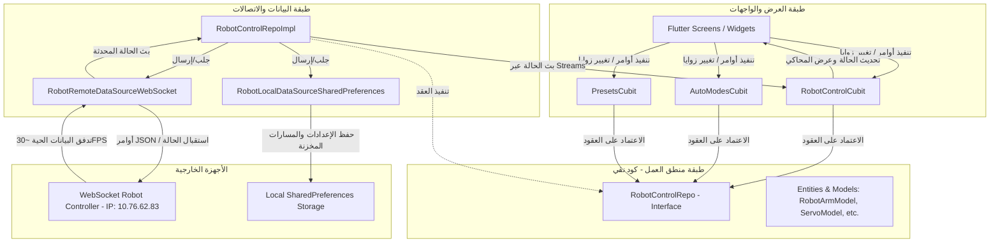
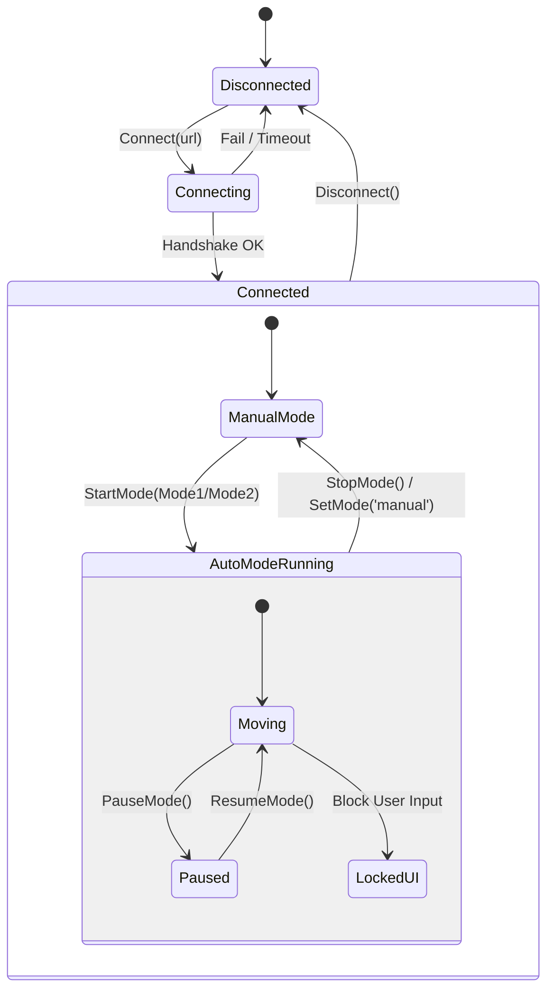

# 🤖 HAZMOVE ROBOT CONTROL SYSTEM - TECHNICAL DOCUMENTATION
## 📄 التوثيق التقني التفصيلي لنظام التحكم في ذراع الروبوت HazMove

مستند تقني شامل يغطي بنية النظام، هندسة البرمجيات، بروتوكولات الاتصال، والرياضيات المستخدمة في المحاكي البصري ثلاثي الأبعاد لتطبيق التحكم في الذراع الروبوتية المدمجة على سكة خطية (Linear Rail).

---

## 🏗️ 1. Architecture Overview (هيكلية النظام العامة)

يعتمد تطبيق **Hazmove Robot** على بنية **Clean Architecture** المتوافقة مع مبادئ separation of concerns (فصل المسؤوليات)، مقترنة بنظام إدارة الحالة **BLoC/Cubit** لضمان تدفق البيانات بشكل تفاعلي وفعال.

### 📊 مخطط تدفق البيانات والبنية المعمارية (Data Flow Architecture)



---

## 🛠️ 2. Core Module & Infrastructure (المكونات الأساسية للنواة)

تضم النواة (`lib/core`) كافة الإعدادات والخدمات المشتركة التي تعتمد عليها الطبقات المختلفة للتطبيق.

### 🔑 2.1 Dependency Injection (حقن الاعتمادية)
ملف التكوين الرئيسي `lib/core/di/main_di.dart` يستخدم مكتبة `GetIt` لتهيئة الأنماط الفردية (Singletons) والمصانع (Factories) عند بدء تشغيل التطبيق:

```dart
final getIt = GetIt.instance;

Future<void> initDI() async {
  // 1. خدمات وتأثيرات الواجهات والثيمات
  getIt.registerLazySingleton<ThemeCubit>(() => ThemeCubit());
  getIt.registerLazySingleton<InternetConnection>(() => InternetConnection());
  getIt.registerLazySingleton<NetworkInfo>(
    () => NetworkInfoImpl(getIt<InternetConnection>()),
  );

  // 2. مصادر البيانات (Data Sources)
  getIt.registerLazySingleton<RobotRemoteDataSource>(
    () => RobotRemoteDataSourceApiImp(),
  );
  getIt.registerLazySingleton<RobotLocalDataSource>(
    () => RobotLocalDataSourceImp(),
  );

  // 3. المستودعات (Repositories)
  getIt.registerFactory<RobotControlRepo>(
    () => RobotControlRepoImpl(
      remoteDataSource: getIt<RobotRemoteDataSource>(),
      localDataSource: getIt<RobotLocalDataSource>(),
    ),
  );

  // 4. كتل إدارة الحالة (Cubits)
  getIt.registerFactory<RobotControlCubit>(
    () => RobotControlCubit(repository: getIt<RobotControlRepo>()),
  );
  getIt.registerFactory<PresetsCubit>(
    () => PresetsCubit(repository: getIt<RobotControlRepo>()),
  );
  getIt.registerFactory<AutoModesCubit>(
    () => AutoModesCubit(repository: getIt<RobotControlRepo>()),
  );
}
```

### 🛣️ 2.2 Navigation and Security Guard (نظام التوجيه وحارس المسارات)
يشتمل التطبيق على حارس أمني للمسارات (`RouteGuard`) يمنع المستخدم من الانتقال إلى شاشات التحكم اليدوي أو التلقائي في حال عدم الاتصال الفعلي بالروبوت:

```dart
class RouteGuard {
  static bool canNavigate(BuildContext context, {bool requireConnection = false}) {
    if (!requireConnection) return true;

    final state = context.read<RobotControlCubit>().state;
    if (state.connectionStatus != ConnectionStatus.connected) {
      ScaffoldMessenger.of(context).showSnackBar(
        const SnackBar(
          content: Text('Please connect to the robot first'),
          backgroundColor: Colors.redAccent,
        ),
      );
      return false;
    }
    return true;
  }
}
```

### 🎨 2.3 Theme & Aesthetic Design System (نظام التصميم الفاخر)
تم بناء الواجهة بلمسة صناعية حديثة (Modern Industrial Design) باستخدام تدرجات غامقة (Dark Mode) ودمجها مع تقنيات Glassmorphism وعناصر مضيئة متغيرة (Ambient Glowing Blobs).

*   **AppColors (`lib/core/style/app_colors.dart`)**:
    *   **Dark Mode**: ألوان غامقة مريحة للعين `0xFF0F1115` كخلفية متدرجة، مع تباينات برتقالية برّاقة `0xFFFF7300` وأخضر زمردي للحالة النشطة `0xFF10B981`.
    *   **Light Mode**: ألوان هادئة وراقية تعتمد على درجات الرمادي الفاتح المائل للأزرق `0xFFF1F5F9`.
*   **GlassContainer (`lib/core/style/glass_container.dart`)**: حاوية تعتمد على مرشحات تنعيم بصرية (`BackdropFilter` مع إزاحة ضبابية `ImageFilter.blur(sigmaX: blur, sigmaY: blur)`) لإعطاء انطباع زجاجي شفاف شبه ناقل للضوء.
*   **AmbientBlob (`lib/presentation/view/home/widgets/ambient_blob.dart`)**: تستخدم تأثيرات التدرج الإشعاعي (`RadialGradient`) لخلق هالات ضوئية ملونة تتحرك في الخلفية لإعطاء حيوية للواجهات.

---

## 💾 3. Data & Domain Modeling (نمذجة البيانات والمجال)

تم تصميم نماذج البيانات لتعكس الحالة الفيزيائية للروبوت بدقة بالغة.

### 📐 3.1 هيكل بيانات الذراع الروبوتية (Robot Arm State Hierarchy)

```
RobotArmModel (الحالة الكلية للروبوت)
 ├── servos (قائمة محركات السيرفو الخمسة)
 │    ├── ID 1: Base (قاعدة الذراع)
 │    ├── ID 2: Shoulder (الكتف)
 │    ├── ID 3: Elbow (المرفق)
 │    ├── ID 4: Wrist (المعصم)
 │    └── ID 5: Gripper (المقبض)
 ├── linearRail (السكة الخطية - سم)
 ├── baseRotation (دوران المنصة الدائرية - بالدرجات)
 ├── mode (الوضع الحالي: manual / auto)
 └── status (حالة الحركة: idle / moving / paused / error)
```

### 📝 3.2 فئات النماذج التقنية (Technical Model Specifications)

#### 1. ServoModel (`lib/modules/robot_control/domain/models/servo_model.dart`)
يمثل محرك سيرفو فردي، ويحتوي على الخصائص التالية:
*   `id` (int): المعرّف الفريد للمحرك.
*   `currentAngle` (int): الزاوية الحالية للمحرك (0° - 180°).
*   `targetAngle` (int): الزاوية الهدف التي يتم توجيهه إليها.
*   `speed` (int): سرعة الحركة المقررة (1 - 100).
*   `isMoving` (bool): مؤشر يوضح ما إذا كان المحرك يتحرك حالياً.

#### 2. LinearRailModel (`lib/modules/robot_control/domain/models/linear_rail_model.dart`)
يتحكم في موضع المنصة الروبوتية على السكة الخطية:
*   `currentPosition` (double): الموضع الحالي (0.0 - 100.0 سم).
*   `targetPosition` (double): الموضع الهدف.
*   `speed` (int): سرعة الحركة الخطية.

#### 3. BaseRotationModel (`lib/modules/robot_control/domain/models/base_rotation_model.dart`)
يتحكم في الدوران الكلي لقاعدة الروبوت (0° - 360°).

---

## 🔌 4. Communication Protocol (بروتوكول اتصالات WebSocket الحية)

يعتمد التطبيق على اتصال مقبس شبكة لاسلكي (WebSocket Connection) ذو زمن استجابة منخفض جداً (Low Latency).

### ⚡ 4.1 Throttling Mechanism (آلية تقييد تدفق البيانات)
لمنع اختناق واجهة المستخدم والتطبيق بسبب تدفق البيانات الهائل القادم من الروبوت (~60 رسالة في الثانية)، تم دمج خوارزمية **Throttling** في معالج البيانات الواردة لتحديد سرعة المعالجة بحد أقصى **30 إطاراً في الثانية (32 مللي ثانية)**:

```dart
DateTime _lastProcessTime = DateTime.now();
static const int _throttleMs = 32; // ~30 FPS

void _handleIncomingData(dynamic data) {
  final now = DateTime.now();
  if (now.difference(_lastProcessTime).inMilliseconds < _throttleMs) {
    return; // تجاهل الرسالة لتوفير موارد المعالج
  }
  _lastProcessTime = now;

  try {
    final Map<String, dynamic> json = jsonDecode(data);
    if (json['type'] == 'status') {
      final robotArm = RobotArmModel.fromJson(json['data'] ?? {});
      _statusController.add(robotArm);
    }
  } catch (e) {
    // معالجة الأخطاء
  }
}
```

### ✉️ 4.2 تنسيقات الأوامر المرسلة (JSON Command Structure)

#### أ. توجيه محرك سيرفو معين:
```json
{
  "type": "servo",
  "servo_id": 3,
  "start": 45,
  "end": 90,
  "speed": 50
}
```

#### ب. توجيه السكة الخطية:
```json
{
  "type": "linear",
  "distance": 75.0,
  "speed": 80
}
```

#### ج. توجيه دوران القاعدة:
```json
{
  "type": "base",
  "degrees": 180.0,
  "speed": 60
}
```

#### د. أوامر الطوارئ والتحكم الفوري:
*   **إيقاف فوري (Emergency Stop):** `{"type": "stop"}`
*   **إيقاف مؤقت:** `{"type": "pause"}`
*   **استئناف الحركة:** `{"type": "resume"}`
*   **تغيير وضع التشغيل:** `{"type": "mode", "mode": "auto"}`

---

## 📐 5. Isometric 3D Simulator Math (رياضيات المحاكي البصري ثلاثي الأبعاد)

يحتوي التطبيق على محاكي بصري فخم مصمم برسم ثنائي أبعاد يحاكي الأبعاد الثلاثية (Isometric 3D Projection) باستخدام فئة `CustomPainter` في فلوتر.

### 📐 5.1 تحويل الإحداثيات (3D Coordinate Conversion)
لتحويل نقطة ثلاثية الأبعاد في الفضاء الفيزيائي للروبوت $(X, Y, Z)$ إلى إحداثيات الواجهة ثنائية الأبعاد $(dx, dy)$، نستخدم الصيغ الرياضية لإسقاط الأيزومتريك بزاوية 30 درجة ($\cos(30^\circ) \approx 0.866$, $\sin(30^\circ) = 0.5$):

$$dx = \text{originX} + (x - y) \times \text{scale} \times \cos(30^\circ)$$

$$dy = \text{originY} + (x + y) \times \text{scale} \times \sin(30^\circ) - z \times \text{scale}$$

تم تطبيق هذه الصيغة برمجياً في الكود كالتالي:
```dart
Offset _p(double x, double y, double z) {
  const double cos30 = 0.866025;
  const double sin30 = 0.5;
  return Offset(
    _ox + (x - y) * _sc * cos30,
    _oy + (x + y) * _sc * sin30 - z * _sc,
  );
}
```
*حيث `_ox` و `_oy` يمثلان نقطة الأصل وسط الشاشة، و `_sc` يمثل مقياس الرسم التقريبي للمحاكاة.*

### 🦴 5.2 حساب زوايا مفاصل الذراع الروبوتية (Kinematics Forward Kinematics Model)
تعتمد زوايا المفاصل المرسومة على زوايا محركات السيرفو الحقيقية المستقبلة من الروبوت. يتم حساب إحداثيات المفاصل المتعاقبة (الكتف J1، المرفق J2، المعصم J3، والمقبض J4) بالتتابع باستخدام حساب المثلثات التراكمي:

```dart
// تحويل الزوايا من الدرجات إلى الراديان
final theta0 = (90.0 - shoulderDeg) * math.pi / 180.0;
final theta1 = theta0 + (elbowDeg - 90.0) * math.pi / 180.0;
final theta2 = theta1 + (wristDeg - 45.0) * math.pi / 180.0;

// أطوال أجزاء الذراع (الروابط الفيزيائية)
const double baseTopZ = 2.1;
const double lowerLen = 3.6;
const double upperLen = 2.9;
const double wristLen = 1.9;

// إحداثيات المفصل الأول (القاعدة فوق السكة)
final j0 = [railX, 0.0, baseTopZ];

// حساب موضع الكتف (J1)
final j1 = [
  j0[0] + lowerLen * math.sin(theta0) * armDirX,
  j0[1] + lowerLen * math.sin(theta0) * armDirY,
  j0[2] + lowerLen * math.cos(theta0),
];

// حساب موضع المرفق (J2)
final j2 = [
  j1[0] + upperLen * math.sin(theta1) * armDirX,
  j1[1] + upperLen * math.sin(theta1) * armDirY,
  j1[2] + upperLen * math.cos(theta1),
];

// حساب موضع المعصم والمقبض (J3)
final j3 = [
  j2[0] + wristLen * math.sin(theta2) * armDirX,
  j2[1] + wristLen * math.sin(theta2) * armDirY,
  j2[2] + wristLen * math.cos(theta2),
];
```

---

## 🚦 6. State Machine & Safety Interlocks (آلة الحالات والأنظمة الأمنية)

يتضمن نظام التحكم آليات أمنية لمنع إرسال الأوامر المتعارضة أو التسبب في تصادمات هيكلية للروبوت.

### 🔒 6.1 حظر التحكم اليدوي أثناء الوضع التلقائي (Auto-Mode Lockdown)
عند تشغيل أحد الأنماط التلقائية (Mode 1 أو Mode 2)، يقفل التطبيق شاشة التحكم اليدوي بالكامل لضمان عدم حدوث تشويش على الإشارات المرسلة للروبوت.



### 📋 6.2 نظام تشغيل وتخزين التعليمات البرمجية المسبقة (Presets Execution Workflow)
يتيح التطبيق للمستخدم صياغة سلسلة من الخطوات وتخزينها محلياً:
1.  كل خطوة تتكون من: (نوع الحركة، المعايير المخصصة مثل الزوايا أو المسافة، وزمن التأخير بالمللي ثانية `delayMs`).
2.  عند التشغيل، يقوم التطبيق بقراءة قائمة الأوامر وإرسالها بالترتيب وبفواصل زمنية مطابقة لـ `delayMs` باستخدام مولد فترات تأخير غير متزامن (`Future.delayed`).

---

## 🌟 7. UI Premium Components & Micro-Animations

لضمان تجربة مستخدم رائدة تليق بالتطبيقات الصناعية الحديثة، تم بناء العناصر التفاعلية التالية:

1.  **محاكي الذراع البصري التفاعلي**: لا يعرض زوايا ثابتة بل يرسم مسار دوران متحرك حول المفاصل يعكس السرعة الحقيقية لحركة الذراع.
2.  **مؤشر الاتصال النابض (Pulsing Glow Connection Indicator)**: يضيء باللون الأخضر أو الأحمر النابض بالتناغم مع حالة الاتصال بالشبكة أو البلوتوث.
3.  **عناصر التحكم اللمسية الذكية**: عند اختيار كارت تحكم معين (مثلاً السكة أو أحد محركات السيرفو)، يتم إبراز ذلك المكون بعينه في المحاكي البصري ليعرف المستخدم تحديداً أي جزء من الروبوت سيتحرك.

---

### 📝 ملخص ملفات التطبيق البرمجية وارتباطاتها (File Dependency Map)

*   `main.dart`: نقطة انطلاق التطبيق ومسؤول تهيئة التهيئة المسبقة للغات وحفظ حالة الثيم.
*   `lib/presentation/view/root/app.dart`: الحاوية الأساسية للتطبيق وتهيئة التوجيه (Routing).
*   `lib/presentation/view/root/cubit/robot_control_cubit.dart`: القلب النابض لإدارة اتصالات الروبوت وبث بيانات الحركة الفورية.
*   `lib/presentation/view/home/home_screen.dart`: الشاشة الرئيسية التي تعرض المحاكي وأزرار التحكم السريع بالطوارئ.
*   `lib/presentation/view/manual/manual_control_screen.dart`: شاشة التحكم اليدوي التفصيلي بجميع مفاصل الروبوت.
*   `lib/presentation/view/auto/auto_mode_screen.dart`: شاشة تشغيل الأنماط التلقائية وإدارة الخطوات المخزنة.
