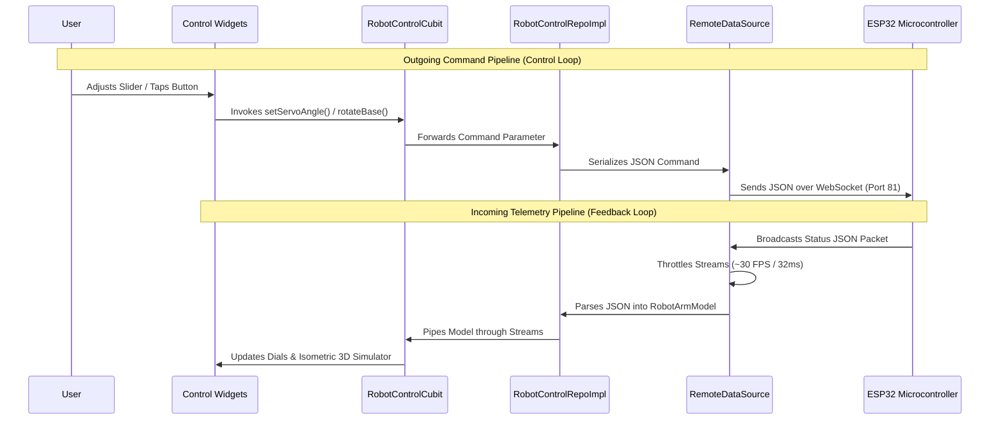

# HazMove Robotic Arm - Flutter Mobile Application Documentation

This document covers the architectural layout, communication data flow, connection pipeline, and screen-by-screen technical specifications for the HazMove Robot Control mobile application.

---

## 1. Software Architecture (Clean Architecture)

The HazMove Mobile Application is built on Clean Architecture principles, ensuring a strict separation of concerns, testability, and scalability. The app code is divided into three distinct layers:

### Presentation Layer
* **Role**: Handles all user interface rendering, themes, localization, and state management.
* **Key Components**:
  * **State Management**: Uses BLoC/Cubit (`RobotControlCubit`, `AutoModesCubit`, `PresetsCubit`) to manage the state of the robot and UI interaction.
  * **Views**: Contains pages (`HomeScreen`, `ManualControlScreen`, `AutoModeScreen`, `SettingsScreen`).
  * **Visual Design**: Utilizes custom layouts (`GlassContainer` for transparent effects, `AmbientBlob` for glowing radial gradients) to maintain a modern industrial aesthetic.

### Domain Layer
* **Role**: The core business logic layer, written in pure Dart independent of UI or external packages.
* **Key Components**:
  * **Repository Interfaces**: Defines contracts (`RobotControlRepo`).
  * **Entities & Models**: Holds robot state structures (`RobotArmModel`, `ServoModel`, `LinearRailModel`, `BaseRotationModel`).

### Data Layer
* **Role**: Implements domain interfaces to handle physical networking and local caching.
* **Key Components**:
  * **Remote Data Source**: `RobotRemoteDataSourceApiImp` implements TCP communication via WebSocket channels.
  * **Local Data Source**: `RobotLocalDataSourceImp` caches connection configurations and movement presets to disk using SharedPreferences.

---

## 2. Data Flow & Connection Pipeline

### Outgoing Command Pipeline
1. **User Interaction**: The user adjusts a control slider or taps an action button.
2. **State Updates**: The UI calls the active Cubit method.
3. **Repository Execution**: The Cubit triggers repository calls inside `RobotControlRepoImpl`.
4. **JSON Serialization**: The repository translates the action parameters into a specific JSON layout (e.g. `{"type": "servo", "servo_id": 2, "end": 90, "speed": 50}`).
5. **WebSocket Transport**: The data source pushes the serialized string over the active `WebSocketChannel` directly to port 81 of the ESP32's IP.

### Incoming Telemetry Pipeline
1. **State Broadcast**: The ESP32 collects physical actuator states and broadcasts a consolidated status JSON packet back to all clients.
2. **Telemetry Throttling**: To prevent UI stuttering, the remote data source throttles incoming status messages to a maximum rate of 32ms (~30 FPS).
3. **Data Parsing**: Valid packets are deserialized and loaded into a new `RobotArmModel` instance.
4. **BLoC Dispatch**: The parsed model is pushed through broadcast streams, causing the active Cubit to emit an updated state.
5. **UI Rendering**: The visual control panels and the 3D isometric simulator (`CustomPainter` widget) re-render immediately to reflect the physical robot's new coordinates.

---

## 3. Screen-by-Screen Documentation

### 3.1 Home Screen (Main Dashboard)
* **Visual Elements**:
  * Brand title header `"HAZMOVE ROBOT"`.
  * Animated isometric illustration of the robot arm.
  * Pulsing connection status indicator pill (`غير متصل` / Disconnected or `متصل` / Connected).
  * Navigation shortcuts: "الوضع التلقائي" (Automatic Mode), "الوضع اليدوي" (Manual Control), and "الإعدادات" (Settings).
* **User Flow**:
  * The user launches the app and sees the connection status. If disconnected, any attempt to navigate to control screens is blocked by the `RouteGuard`.
  * The user taps 'Settings' (الإعدادات) to configure and connect to the ESP32 socket.
  * Upon successful connection, the indicator turns green, unlocking the main manual and auto controls.
* **Technical Details**:
  * **State Management**: Subscribes to the `ConnectionStatus` stream in `RobotControlCubit`.
  * **Security Guard**: Implements `RouteGuard` which checks states to prevent unauthorized screen navigation when offline.

---

### 3.2 Automatic Mode Screen
* **Visual Elements**:
  * Header title `"الوضع التلقائي"`.
  * Multi-colored execution cards for sequence presets: `"الوضع 1"` (Mode 1 - first path) and `"الوضع 2"` (Mode 2 - second path).
* **User Flow**:
  * The user taps on an Automatic Mode card.
  * The app sends the mode activation command and displays an execution status.
  * A full-screen overlay appears to disable manual joint control sliders, preventing physical crashes.
* **Technical Details**:
  * **State Machine**: Employs `AutoModesCubit` to dispatch automated routines.
  * **Safety Interlock**: Prevents overrides by locking the UI with a descriptive overlay warning when auto mode is running.
  * **Preset Engines**: Triggers sequential steps stored locally on SharedPreferences, transmitting commands with asynchronous `Future.delayed()` intervals.

---

### 3.3 Manual Control Screen
* **Visual Elements**:
  * Header title `"الوضع اليدوي"`.
  * A 3x2 parameter dashboard (Shoulder angle, Base rotation, Wrist angle, Elbow angle, Linear Rail position, Gripper angle).
  * Joint selection checkmark indicator.
  * Dedicated input slider for the selected joint.
  * Control action buttons at the bottom: "Stop", "Pause", and "Reset".
* **User Flow**:
  * The user selects a joint card (e.g. Base), which loads its control slider.
  * The user drags the slider to adjust coordinates.
  * If a manual override is needed, the user taps the red "Stop" or orange "Pause" buttons at the bottom.
* **Technical Details**:
  * **Actuator Units**: Base platform uses degrees (0°-360°), Linear Rail uses centimeters (0.0-100.0cm), and joint servos use degrees (0°-180°).
  * **Visual Synchronization**: Selecting a joint card dynamically highlights the corresponding joint link in the 3D isometric simulation widget.
  * **Emergency Stops**: Tapping "Stop" sends a raw JSON command (type: `'stop'`) that aborts all physical loops on the ESP32 immediately.

---

### 3.4 Settings Screen
* **Visual Elements**:
  * Header title `"الإعدادات"`.
  * Connection settings section (WebSocket text input `ws://10.76.62.83:81`, Connect and Disconnect buttons).
  * Appearance & Language settings (Light Mode toggle, Language switch AR/EN).
  * About section displaying app details.
* **User Flow**:
  * The user navigates to Settings to configure Wi-Fi networking.
  * The user inputs the IP address of the ESP32 and taps 'Connect' (اتصال).
  * The user changes language or toggles the theme if desired.
* **Technical Details**:
  * **Local Persistence**: Caches connection URLs inside `SharedPreferences` to auto-connect on future boots.
  * **Localization**: Integrated with `Easy Localization` to dynamically translate all UI nodes between Arabic and English.
  * **Network Handling**: Captures socket connection errors, triggering descriptive status notifications on the UI.
